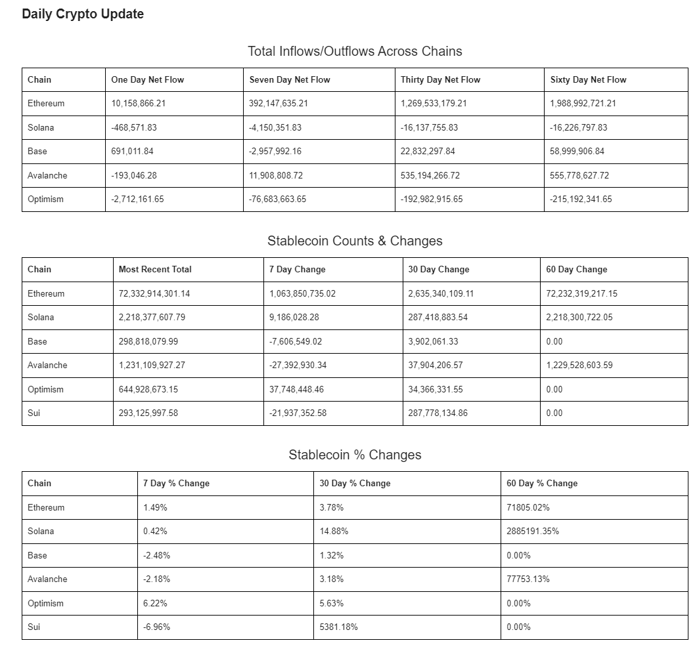
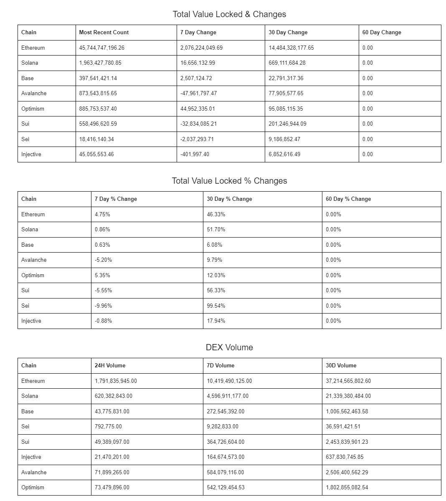

# Chain-Flows
---
Chain Flows consists of four different python scripts:
1. initial_data.py
2. update_data.py
3. visualize_html.py
4. tables_email.py

## What is it?
Chain Flows aggregates data from 8 different cryptocurrency blockchains using the [DefiLlama API](https://defillama.com/docs/api). After downloading the required packages, you can run the 'initial_data.py'
file to create an SQLite database that will hold all of the data for you. The script gathers the historical 60 days of data tracking 4 different categories of data:
1. Net Inflows/Outflows
    * Measures the amount of money flowing in and out of each blockchain on a daily basis. The next inflow/outflow is also calculated on a rolling 7d, 30d, and 60d basis.
2. Stablecoin Balances
    * Returns the value of stablecoins held on each blockchain. Similarly tracks the change in stablecoin balances across 7d, 30d, and 60d periods. 
3. Total Value Locked (TVL)
    * Measures total value of digital assets that are locked or staked in a DeFi protocol.
4. Decentralized Exchange (DEX) Volume
    * Returns total volume traded throughout DEX's on each chain - includes 7d,30d,60d calculations as well.

## Updating, Visualizing, Sending
The 'update_data.py' file can be ran each day to update the SQL database with the most recent data for each table. The 'tables_email.py' file imports some helper functions from 'visualize_html.py'
and subsequently accesses the SQL database, pulls the data, performs calculations to return % changes in relevant data categories, and then uses prettytable to construct an HTML table to 
visualize and print all relevant data. Finally, tables_email.py then connects to your email, and sends these tables to any number of recipients you choose. This process is then automated using AWS to schedule to code to run at specific times to be received daily. See below images for final product:

